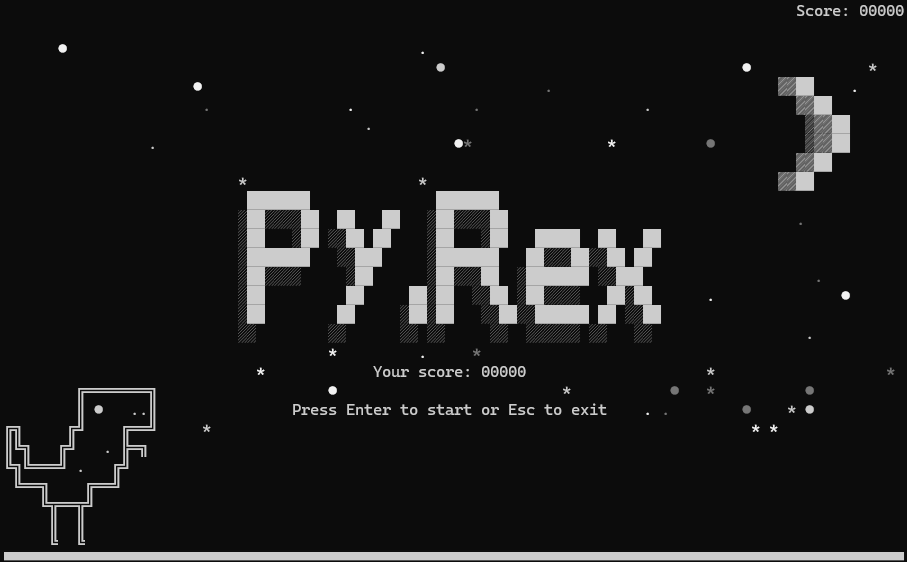
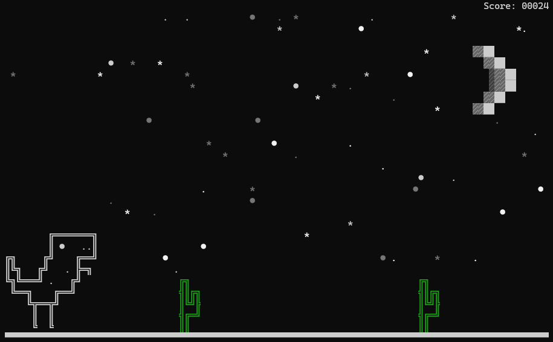

# Py.Rex

## About the project

This project is a simple console implementation of the Google Chrome Dinosaur game. It is intentionally written with minimal use of external frameworks and libraries, keeping it as straightforward as possible. All graphics are directly displayed in the console as characters and are redrawn with each frame change. All objects in the game are also character-based, without using complex graphics. The difficulty level gradually increases after the game starts, with cacti appearing more frequently. The game's environment (the starry sky and the moon) is randomly generated, so the sky will be different each time you launch the game. You can run this program even on a server with minimal available resources (though I don't recommend doing that; it's just a joke).

## Screenshots

Start screen



In game



Lose screen


## Installation 

1. Clone the repository (use these commands in the terminal):    
   ```git clone https://github.com/piratinskii/Py.Rex.git```
   ```cd Py.Rex``` 

2. (Optional) Create a virtual environment:   
   ```python -m venv venv```
   ```source venv/bin/activate  # On Windows, use `venv\Scripts\activate```

3. Install dependencies:    
   ```pip install -r requirements.txt``` 

## Usage 

Run the game: 

```python game.py```

## Testing

The project also includes unit tests to verify its functionality. You can run them using the following command:

```python test_game.py```

## Configuration

You can configure the game settings in `src/config.py`:

- `RESOLUTION`: Screen (area in the terminal) resolution (height, width) in symbols. By default it's 30x100
- `MIN_DISTANCE_BETWEEN_CACTI`: Minimum distance between cacti. You can change it to increase/decrease the level of difficulty.
- `DIFFICULTY`: Game difficulty multiplier. 
- `CACTUS_SPAWN_CHANCE`: Probability of a cactus spawning. This also affect the difficulty.

## Project Structure

```
Py.Rex/
├── src/
│   ├── __init__.py
│   ├── arts.py
│   ├── cactus.py
│   ├── config.py
│   ├── dino.py
│   ├── game.py
│   ├── utils.py
├── screenshots/
│   ├── img.png
│   ├── img_1.png
|	├── img_2.png
├── game.py
├── test_game.py
├── requirements.txt
├── README.md
```

- `src/arts.py`: Contains ASCII art for the game.
- `src/cactus.py`: Cactus class representing obstacles.
- `src/config.py`: Configuration settings.
- `src/dino.py`: Dino class representing the player character.
- `src/game.py`: Game class handling game logic and rendering.
- `src/utils.py`: Utility functions for the game.
- `game_new.py`: Main game script.
- `test_game.py`: Unit tests for the game.
- `requirements.txt`: List of dependencies.
- `README.md`: This file.

## Contributing

Contributions are welcome! Please fork the repository and submit a pull request with your changes.

## License

This project is licensed under the MIT License - see the LICENSE file for details.
